<p align="center">
  
</p>

<p align="center">
  
  
  
</p>

<p align="center">
  <b><a href="#установка">Установка</a></b> ·
  <a href="#как-устроено">Как устроено</a> ·
  <a href="CONTRIBUTING.md">Как предложить изменение</a> ·
  <a href="CHANGELOG.md">История версий</a>
</p>

---

**Дневник** - юзерскрипт, который заменяет интерфейс электронного журнала [journal.top-academy.ru](https://journal.top-academy.ru) на свой: оценки, расписание, домашние задания, награды и оплата в одном тёмном окне. Своего сервера нет - скрипт работает прямо на странице журнала под твоим входом, поэтому логин, пароль и оценки никуда не уходят.

> Неофициальный проект студента. Сейчас это **бета**: основные разделы работают, но журнал может поменять свой API, и тогда часть разделов временно перестанет работать.

<p align="center">
  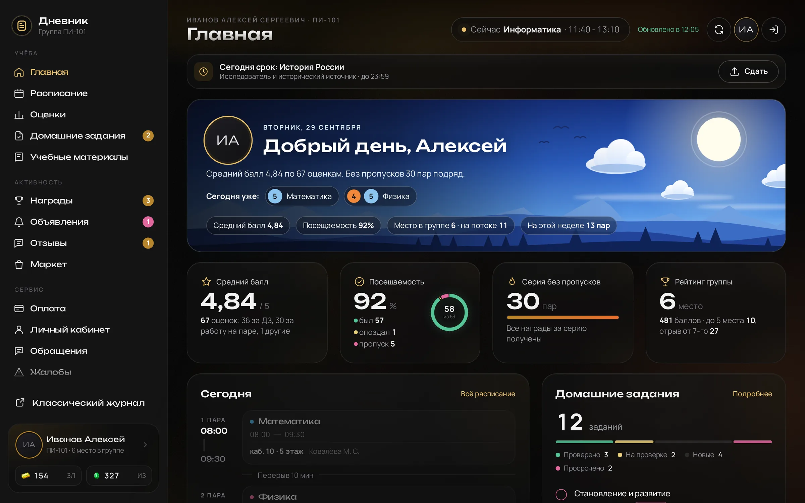
</p>

## Что внутри

| | |
|---|---|
| **Главная** | Приветствие с картиной времени суток, оценки за сегодня, средний балл, посещаемость, серия без пропусков, место в группе, пары на сегодня, задания и рейтинг. |
| **Уведомления** | День рождения, новая версия, скоро оплата, опрос академии, срок ДЗ сегодня, оценка занятий. Каждое закрывается крестиком. |
| **Расписание** | Неделя или день, текущая пара с временем до конца, окно пары с кабинетом, этажом и преподавателем. |
| **Оценки и цели** | Цель по баллу и по посещаемости, календарь месяца, посещаемость по неделям, средние показатели, таблица по предметам. |
| **Все пары** | По неделям с листанием пальцем или весь месяц плитками, как в журнале. Пропуски и опоздания - цветом рамки. |
| **Домашние задания** | Все состояния задания из журнала. Сдать можно прямо из Дневника: файл, текст или ссылка, время выполнения и отзыв. |
| **Награды и отзывы** | Золото, изумруды, полученные достижения и те, что ещё впереди, последние начисления, отзывы преподавателей. |
| **Итоги месяца** | Появляются на главной 1-3 числа, сохраняются картинкой. |
| **Настройки** | Цвет акцента (6 вариантов), пиксельная валюта, вид “Всех пар”, разделы меню, проверка обновлений. |
| **Крипта** | Шутка для друга, которая стала функцией: курс доллара, BTC, TON, SOL, ETH и индекс страха и жадности. По умолчанию выключена. |

<details>
<summary><b>Посмотреть скриншоты</b></summary>
<br>

| Уведомления | Все пары по неделям |
|---|---|
| 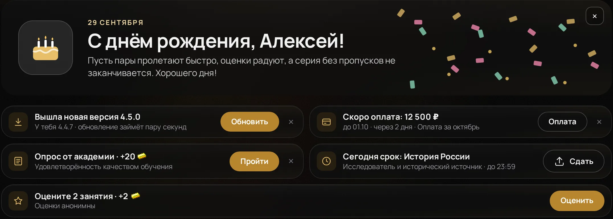 | 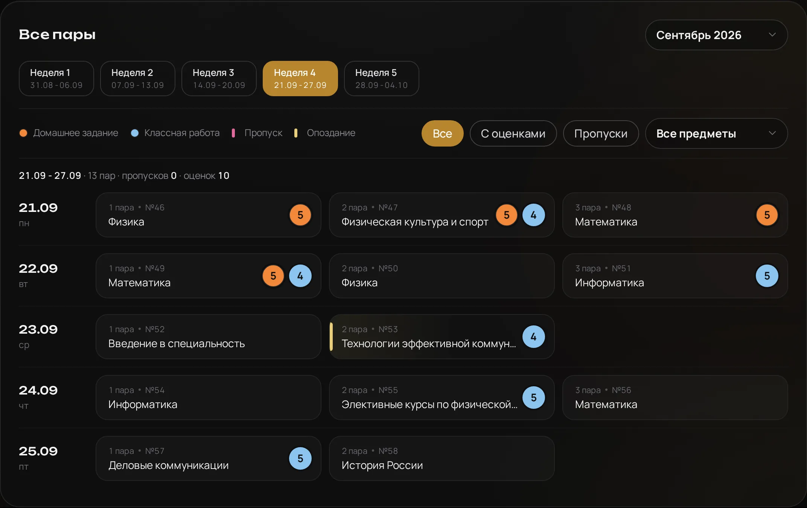 |

| Окно сдачи задания | Экран входа |
|---|---|
| 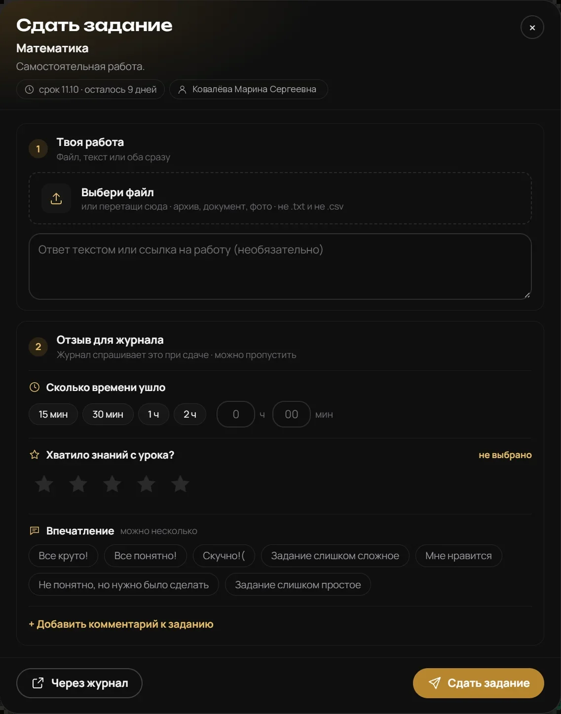 | 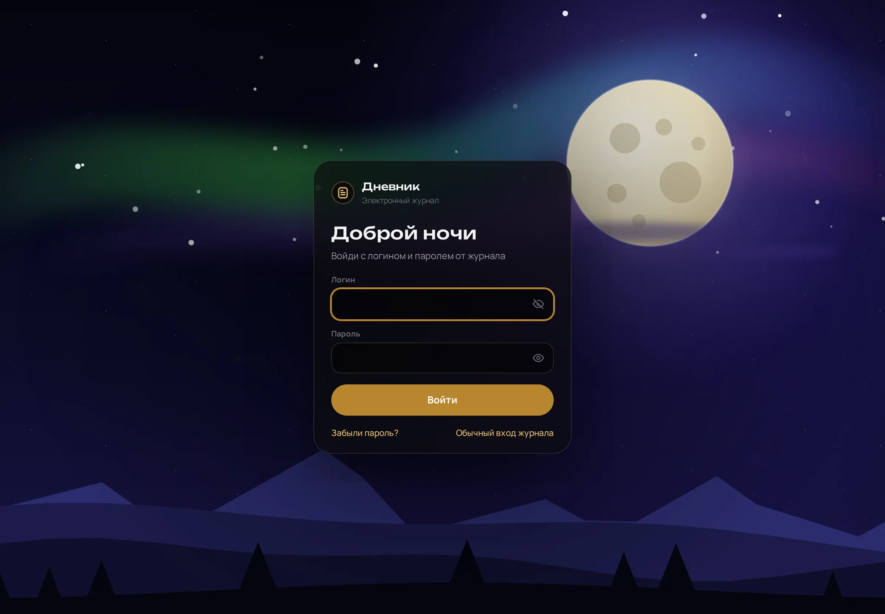 |

| Оценки и цели | Награды |
|---|---|
| 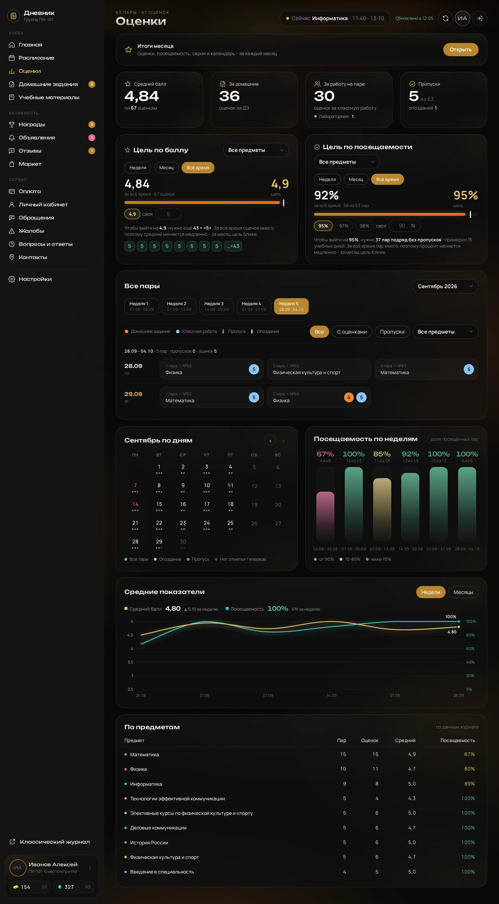 | 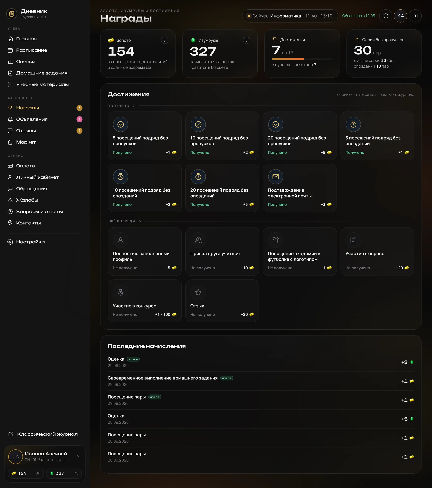 |

| Янтарь | Аметист | Малахит |
|---|---|---|
|  | 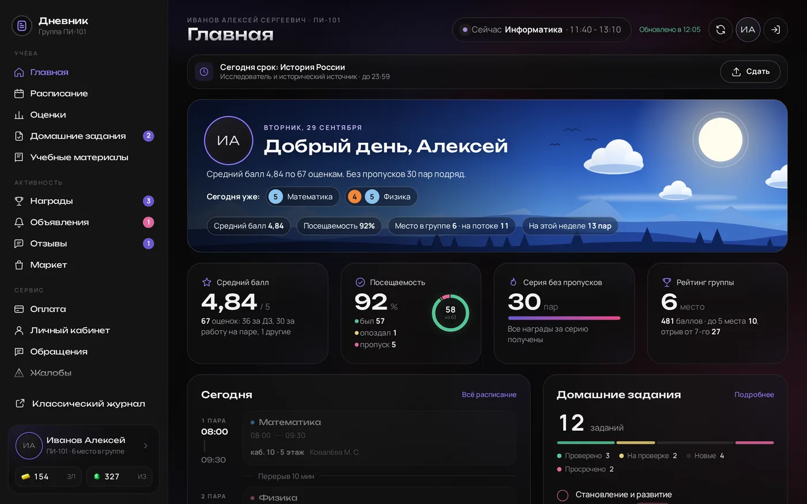 | 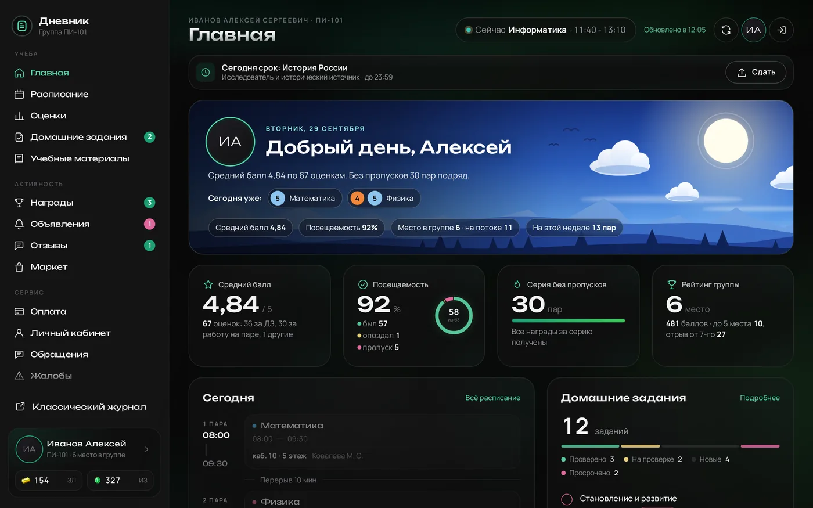 |

**iPhone**

<p>
  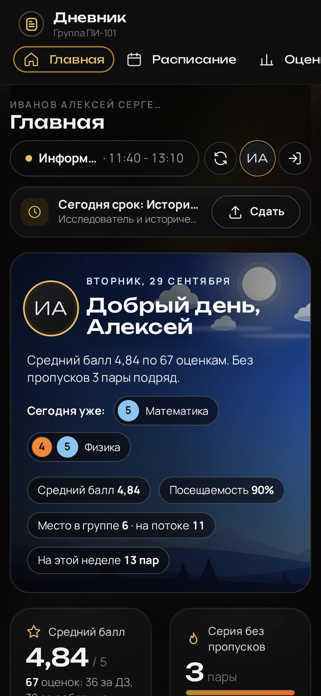
  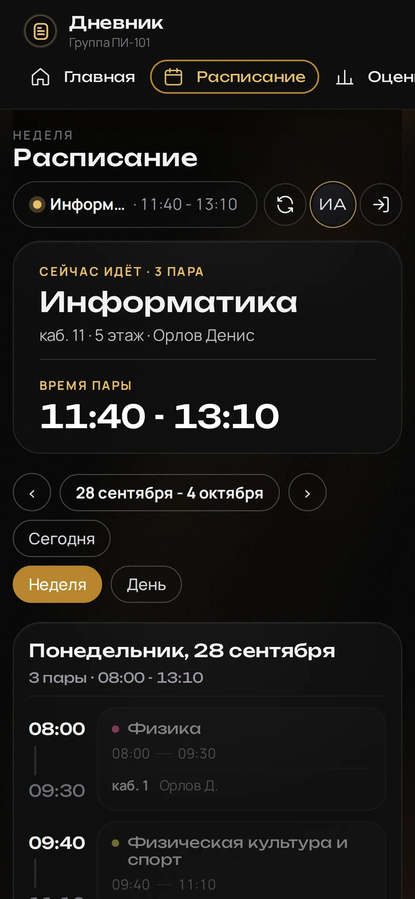
  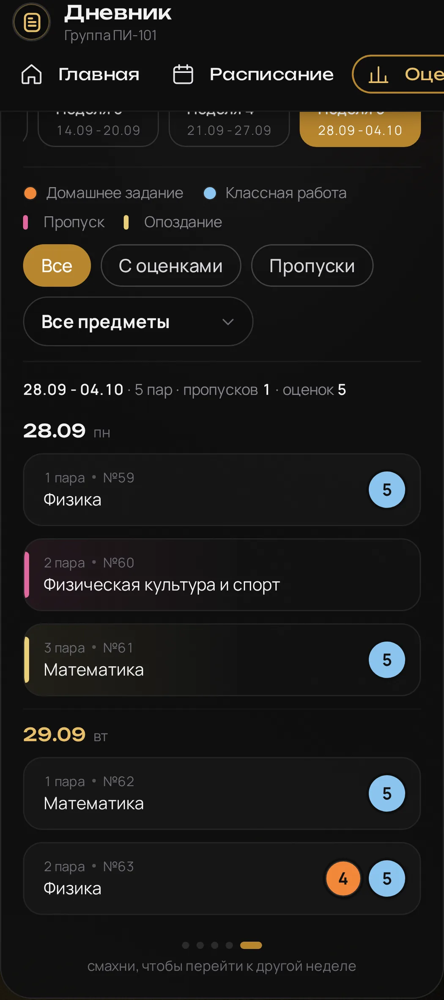
</p>

**Крипта**

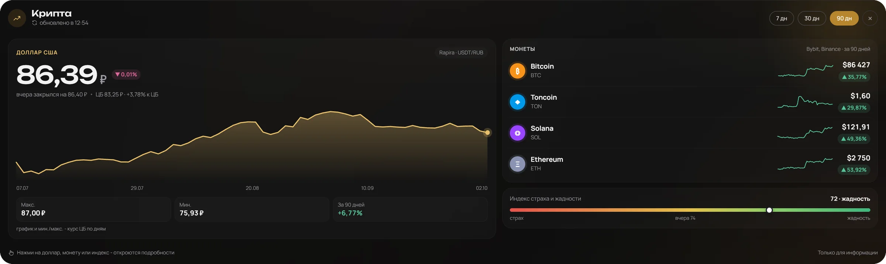

</details>

## Установка

Нужен менеджер юзерскриптов для своего браузера и файл [`dist/dnevnik.user.js`](dist/dnevnik.user.js). Ставится **один раз** - дальше Дневник сам сообщает о новой версии.

<details>
<summary><b>MacBook</b> - Safari + Userscripts</summary>

1. App Store → [Userscripts](https://apps.apple.com/us/app/userscripts/id1463298887) (Justin Wasack) → Загрузить.
2. Сначала открыть сайт журнала в Safari. Потом открыть приложение Userscripts → Open Safari Settings → **“Изменить сайты...”** → у journal.top-academy.ru поставить **“Разрешить”**. Если журнала нет в списке - **разрешить для всех сайтов**.
3. Зайти на [сайт проекта](https://havin8.github.io/dnevnik/) или скачать [`dist/dnevnik.user.js`](dist/dnevnik.user.js).
4. Нажать на значок `</>` слева от адресной строки → первая иконка папки сверху → перетащить в папку **scripts** скачанный файл Дневника.
5. Открыть сайт журнала и дать все разрешения.
</details>

<details>
<summary><b>iPhone</b> - Safari + Userscripts</summary>

1. App Store → [Userscripts](https://apps.apple.com/us/app/userscripts/id1463298887) (разработчик Justin Wasack) → Загрузить. Нажать **Userscripts App Documents**, чтобы создалась папка.
2. Настройки iPhone → Приложения → Safari → Расширения → Userscripts: включить **“Использование расширения”**, в правах доступа **“Другие сайты”** - **Разрешить**.
3. Зайти на [сайт проекта](https://havin8.github.io/dnevnik/) или скачать [`dist/dnevnik.user.js`](dist/dnevnik.user.js) и выбрать папку **Userscripts**.
4. Открыть сайт журнала и дать все разрешения.
</details>

<details>
<summary><b>Компьютер</b> - Chrome, Edge, Яндекс, Opera</summary>

1. Скачать файл Дневника с [сайта](https://havin8.github.io/dnevnik/) или [`dist/dnevnik.user.js`](dist/dnevnik.user.js).
2. Поставить расширение [Tampermonkey](https://chromewebstore.google.com/detail/tampermonkey/dhdgffkkebhmkfjojejmpbldmpobfkfo?hl=ru) из магазина расширений браузера.
3. Открыть **страницу расширений** в браузере, включить **“Режим разработчика”**, а в сведениях о Tampermonkey - **“Разрешить пользовательские скрипты”**.
4. Открыть **“Панель управления”** Tampermonkey → промотать до **“Утилиты”** → **“Импорт из файла”** → выбрать скачанный файл Дневника → в окне подтверждения нажать **“Установить”**.
5. Открыть сайт журнала.
</details>

<details>
<summary><b>Android</b> - Edge, Firefox, Яндекс Браузер, Cromite</summary>

1. Скачать файл Дневника с [сайта](https://havin8.github.io/dnevnik/) или [`dist/dnevnik.user.js`](dist/dnevnik.user.js).
2. Поставить расширение [Tampermonkey](https://chromewebstore.google.com/detail/tampermonkey/dhdgffkkebhmkfjojejmpbldmpobfkfo?hl=ru).
3. В расширениях браузера включить Tampermonkey. В **“Управление расширениями”** (⋮) включить **“Разрешить пользовательские скрипты”** и доступ **“На всех сайтах”**.
4. Открыть **“Панель управления”** Tampermonkey → промотать до **“Утилиты”** → **“Импорт из файла”** → выбрать скачанный файл Дневника → в окне подтверждения нажать **“Установить”**.
5. Открыть сайт журнала.

Chrome на Android расширения не поддерживает, поэтому нужен браузер с расширениями. Проверено в Cromite - спасибо Михаилу за помощь.
</details>

**Обновление.** На главной появляется плашка “Вышла новая версия”. Уведомление иногда может не прийти, поэтому время от времени проверяй сам: Настройки → “Проверить обновления”. На компьютере и Android: нажать “Обновить” → “Подтвердить”, если не сработало - Tampermonkey → Утилиты → “Проверить обновления скриптов”. На iPhone и Mac: значок расширения слева от адреса → Userscripts → переустановить.

**Если что-то работает странно.** С VPN или на нестабильном интернете бывают сбои синхронизации, интерфейса и отдельных функций - сильнее всего в “Крипте”. Если не помогает обновить страницу - переключи сервер VPN или выключи его.

## Как устроено

```
 Сайт журнала  ──токен──▶  Дневник: перехватчик + очередь  ──JSON──▶  Кэш и интерфейс
 (вход по логину)          (≈40 адресов API журнала)                  (Shadow DOM поверх страницы)
```

1. **Вход.** Ты входишь в журнал как обычно. Журнал получает ключ доступа (токен), он живёт 6 часов и сам продлевается.
2. **Данные.** Сайт журнала - только оболочка, данные он берёт с `msapi.top-academy.ru/api/v2/…` в формате JSON. Перехватчик на странице видит запросы журнала и берёт оттуда токен, после чего Дневник запрашивает те же адреса: по несколько за раз, с повтором при ошибке. На iPhone запросы идут через саму страницу журнала.
3. **Экран.** Ответы разбираются, считаются цели и серии, копия хранится в браузере - следующий вход открывается мгновенно. Интерфейс живёт в отдельном слое (Shadow DOM), стили журнала ему не мешают.

Основные адреса API:

| Адрес | Что даёт |
|---|---|
| `schedule/operations/get-by-date-range` | расписание за выбранные дни |
| `progress/operations/student-visits` | посещения и оценки за пары |
| `homework/operations/list`, `count/homework` | домашние задания и счётчики |
| `dashboard/progress/leader-group`, `leader-stream` | рейтинг группы и потока |
| `dashboard/progress/activity` | начисления топкоинов и топгемов |
| `payment/operations/index`, `schedule` | оплата и график платежей |
| `reviews/index/list` | отзывы преподавателей |
| `feedback/students/evaluate-lesson-list` | пары, которые можно оценить |
| `settings/user-info` | профиль, фото, валюта, день рождения |

## Безопасность

- **Своего сервера нет.** Логин и пароль вводятся только в журнал, Дневник их не хранит и никуда не отправляет.
- **Только известные адреса.** В заголовке скрипта (`@connect`) перечислены серверы, к которым он обращается: журнал и его хранилище фото, Gist для обновлений и источники курсов для Крипты.
- **Диагностика без личных данных.** Токены, пароли, телефоны и адреса в ней скрываются.
- **Официальная сборка - только из этого репозитория и Gist автора.** Не ставь копии Дневника из других источников: изменённый скрипт может навредить. Как сообщить об уязвимости - в [SECURITY.md](SECURITY.md).

## Структура репозитория

```
src/
  app.js        логика: данные журнала, разделы, окна, обновления
  base.css      базовые стили
  extra.css     стили разделов
  neo.css       тёмный стиль: стекло, свет акцента, телефон
  market.css    стили Крипты
  icons.js      иконки (SVG)
fonts/          шрифты Unbounded и Manrope (SIL OFL 1.1), зашиваются в сборку
scripts/        форматирование сборки
build.py        сборка одного файла
dist/
  dnevnik.user.js   готовый файл для установки
docs/           баннер и скриншоты для этой страницы
```

**Сборка:** нужны Python 3 и Node.js.

```bash
npm install
npm run build      # → dist/dnevnik.user.js
```

## Как предложить изменение

Нашёл баг или есть идея - открой [Issue](../../issues/new/choose). Хочешь поправить сам - сделай форк, внеси изменения в `src/` и пришли Pull Request. Подробно - в [CONTRIBUTING.md](CONTRIBUTING.md). Все изменения проверяет и принимает автор, и только после этого они попадают в официальную сборку.

## Лицензия

[MIT](LICENSE). Можно брать код, менять его и делать свои сборки - главное, сохранить файл LICENSE.
